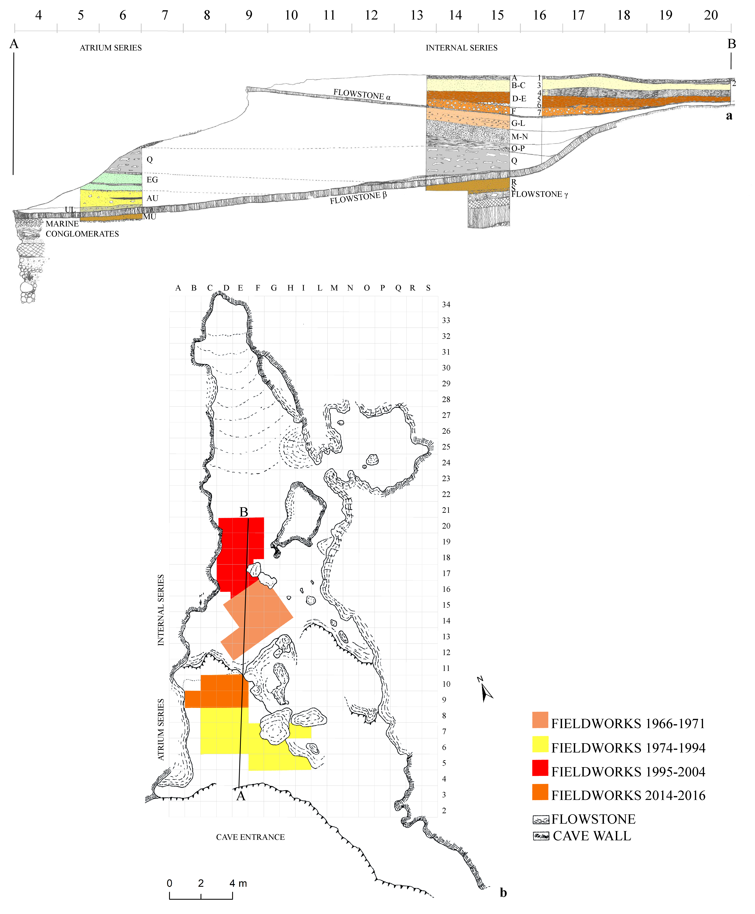
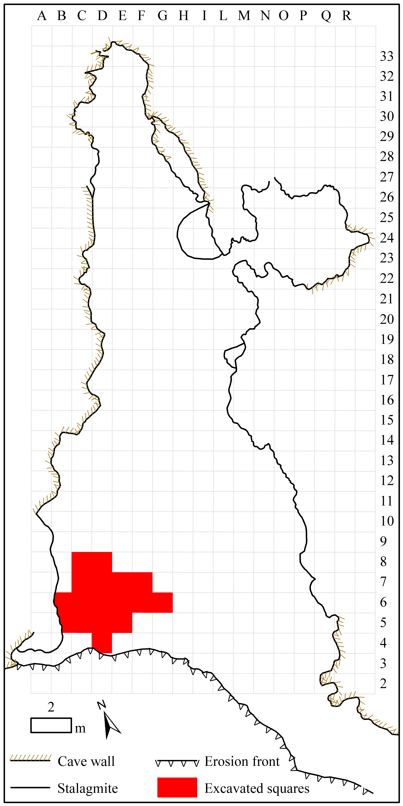
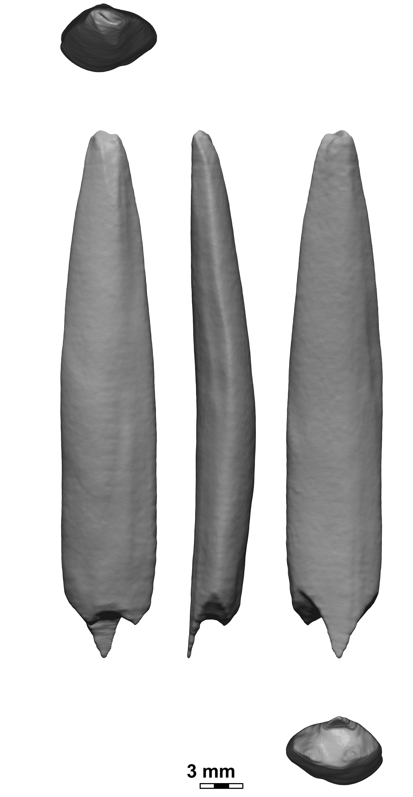
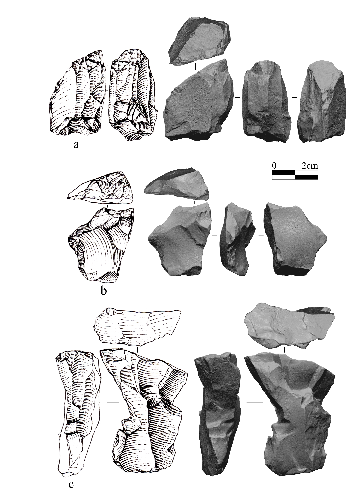
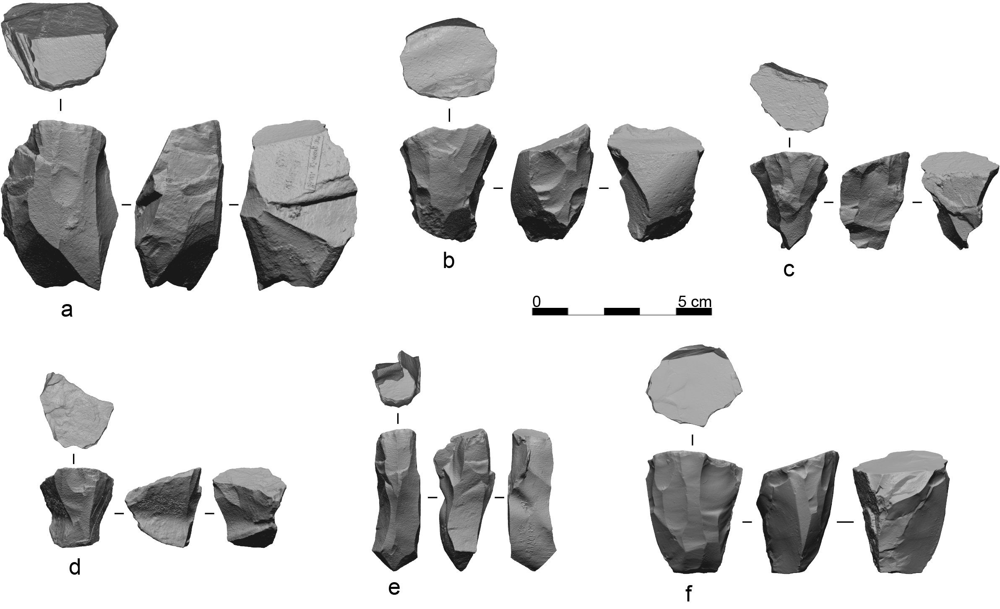
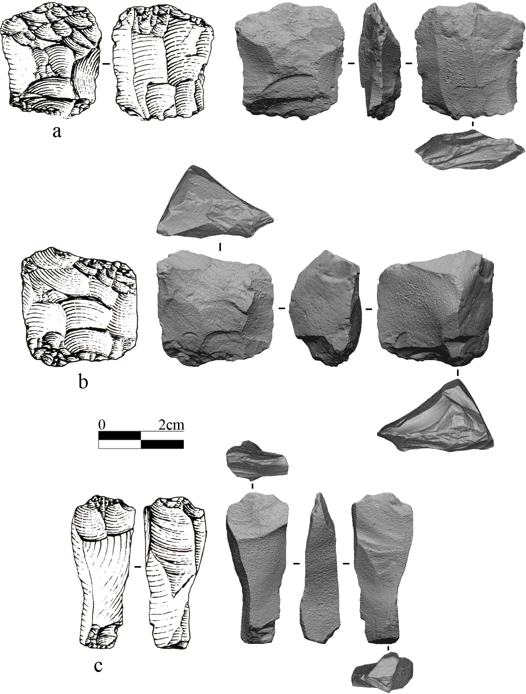
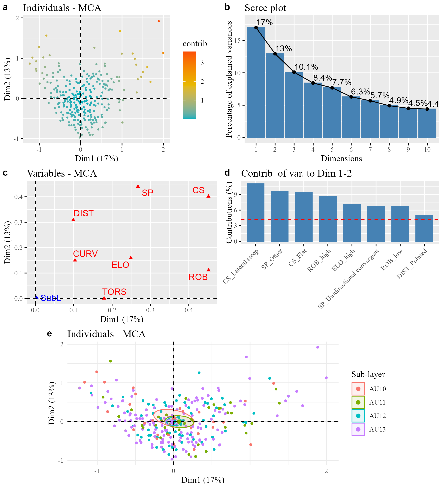

```{r setup, include=FALSE}
knitr::opts_chunk$set(echo = TRUE)
```

```{r, include=FALSE, warning=FALSE}
# Packages used
library(readxl)
library(knitr)
library(kableExtra)
library(dplyr)
library(tidyr)
library(janitor)
library(forcats)
library(rstatix)
library(tidyverse)
library(MetBrewer)
library(plyr)
library(forcats)
library(scales)
library(cowplot)
library(ggpubr)
library(flextable)
library(extrafont)
```

```{r include=FALSE, warning=FALSE}
# Load datasets
Dataset <- readr::read_csv(file = "../data/Ca_Dataset_complete.csv", col_names = TRUE,
                           col_types = readr::cols(
                             `Sub-layer` = readr::col_factor(levels = c("AU10", "AU11", "AU12", "AU13")
                           )))

Dataset_cores <- readr::read_csv(file = "../data/Ca_Dataset_cores.csv", col_names = TRUE,
                           col_types = readr::cols(
                             `Sub-layer` = readr::col_factor(levels = c("AU10", "AU11", "AU12", "AU13")
                           )))

comparison <- list(c("AU13", "AU12"), c("AU13", "AU11"), c("AU13", "AU10"), c("AU12", "AU11"), c("AU12", "AU10"), c("AU11", "AU10"))
```

<br>

## SM Note 1: Methodological remarks on lithic analysis

All studied artifacts were first classified into broad raw material categories based on macroscopic features and, where present, the type of cortex. We recorded several metric and categorical attributes for individual lithic artifacts to investigate the technological organization of stone tool production (e.g., Tafelmaier, 2017; Zwyns, 2012). Both blanks and cores were measured using a digital caliper with a precision of 0.2 mm and a resolution of 0.1 mm. Blanks were measured after being oriented according to their technological axis, while cores were measured based on their technological orientation. For laminar cores, length was measured along the longitudinal axis of the flaking surface, as described by Lombao et al. (2023). Cortex coverage on both cores and blanks was recorded in five intervals: 0%, 1-33%, 33-66%, 66-99%, and 100%.

On blanks, we recorded the direction and orientation of removals, the shape and size of the platform, the presence and intensity of butts and lips, the profile curvature and twisting in profile view, and the external morphology of the entire blank, including its distal side in dorsal and profile views. Retouched tools and blank fragments were excluded when quantifying the morphometric features of blanks before modification. We classified laminar blanks into two main categories—blades and bladelets—based on the metric boundary established by Tixier (1963), where a bladelet is defined as a laminar blank with a width below 12 mm. While bladelets should ideally have a length at least twice their maximum width, we found that this strict definition is not always applicable to Aurignacian assemblages, especially for those produced from carinated cores. As demonstrated at Castelcivita, bladelets from carinated production can be less elongated than those from platform cores, with some having a length-to-width ratio slightly below 2 (Falcucci et al., 2024). These artifacts are abundant at La Cala (n = 104), so we introduced an additional classification borrowed by Moroni et al. (2018)—“flakelets”—to highlight these blanks for future studies. It is important to notice that flakelet in this context does not refer to the small-sized flakes resulting from the Uluzzian bipolar knapping, as in Moroni et al. (2018).

On cores, we recorded the directionality and orientation of removals, the number and shape of striking platform(s), the length and width of the flaking surface, the dimensions of the last removals (i.e., width and thickness), and the presence of removals related to initialization and maintenance operations. Core classification was based on their morphological attributes and the last visible removals, which indicate the production objective at discard. The primary core classification follows Conard et al. (2004), while blade and bladelet cores were further subclassified according to Falcucci & Peresani (2018). Carinated cores received particular attention, with their analysis and classification guided by studies focused on the Aurignacian (Chiotti, 2000; Falcucci et al., 2024; Le Brun-Ricalens & Brou, 2003; Le Brun-Ricalens, 2005). 

Tool types were classified following a revised and simplified version of common tool typologies (de Sonneville-Bordes, 1960; Demars & Laurent, 1992) as outlined in Falcucci et al. (2024). Carinated cores were also classified as tools for inter-site comparison, acknowledging their potential multifunctional purpose. Similarly, burins were classified as cores when they exhibited multiple bladelet negatives oriented along the longitudinal axis of the blank and featured a prepared, plain striking platform.

<br>

## SM Note 2: Microcomputed tomography of the split-based point from AU13

### Methodological remarks

The osseous tool from AU13 (Fig. S14a) was scanned using X-ray micro-computed tomography (microCT) at the Tomolab station (Mancini et al., 2007)  located at Elettra Sincrotrone Trieste, Basovizza (Italy). The system utilizes a sealed microfocus X-ray source (Hamamatsu L9181) coupled with a CCD camera (VHR, Photonics Science) featuring a 4008×2672 pixel matrix with a pixel size of 12.5 µm. For both the distal and proximal regions of the tool, 1,440 projections were acquired over 360 degrees, resulting in an equivalent pixel size of 7 µm (with a focal spot size of 8 µm). The acquisition parameters for the two regions were set at 70 kVp and 100 µA for the distal region, and 115 kVp and 75 µA for the proximal region, using Al filters of 0.5 mm and 1.5 mm, respectively. The slices were reconstructed using the NRecon software package (Version 1.7.0.4), with a voxel size of 7 μm. Volume renderings of the object and the internal canal network in both the distal and proximal regions were analyzed using the Avizo Software package (ThermoFisher Scientific, Version 2022.1).

The same system was used to scan the reference samples included in the analysis: two archaeological specimens from the Upper Paleolithic layers of Grotta della Cala and Grotta Paglicci, as well as a modern reference sample of unworked deer antler. The first archaeological sample is a bone point from layer GB1d (Early Gravettian - atrium series) of La Cala, identified by Boscato et al. (1997) as made from an undetermined fragment of a long bone diaphysis, with visible internal cavity and trabecular structure at one end. According to their description, the point (86 × 5 × 9 mm) features a facetted oval cross-section and an asymmetrical, beveled apex, and is covered with longitudinal striations converging toward the tip, along with short parallel transverse striations in the central area (Boscato et al., 1997). The intentional oblique fracture at the base and a shallow notch in the proximal area have been hypothetically associated with hafting practices, identifying it as a spearpoint (Boscato et al., 1997). To compare its internal microstructure with that of the split-based point from AU13, the medial area of the point was examined.

The second archaeological specimen is a fusiform spearpoint recovered from layer 17D1 (Early Epigravettian) of Grotta Paglicci (Apulia). Borgia et al. (2016) identified this sample as having been produced from a red deer (*Cervus elaphus*) antler fragment, consisting of both cortical and trabecular tissue. This tool (80 × 13 × 10 mm) has a sub-oval cross-section, a fractured apex, and is nearly symmetrical, with a rounded base featuring deep oblique notches and dark residues possibly related to hafting (Borgia et al., 2016). For comparison with the osseous tool from AU13, the central region of this spearpoint was analyzed. The modern reference of unworked antler is a tine from Cervus elaphus sourced from the osteological reference collection of the University of Siena, with the apical region of the tine considered for the present analysis.

### The bone point from layer GB1d (La Cala) and the antler point from layer 17D1 (Paglicci)

The three-dimensional network of Haversian systems in the cortical region of the bone point from layer GB1d (La Cala) and the antler point from layer 17D1 (Paglicci) are illustrated in Fig. S14d and Fig. S14e, respectively. In the bone point from layer GB1d (Fig. S14d), the Haversian canals are arranged in an orderly manner, with larger longitudinal systems located just beneath the external surface, interspersed with thinner, more randomly oriented canals towards the interior. This region corresponds to the outermost layer of cortical bone from a fragment of the diaphysis, where the presence of larger canals is associated with proximity to the trabecular structure at one of the epiphyseal ends. The longitudinal orientation of the Haversian canals is clearly visible in this specimen, which is typical of long bones in the appendicular skeleton, where the osteons are inclined at an angle between 5° and 15° from the bone axis to better resist maximum principal stress (Heřt et al., 1994).

In contrast, the cortical region of the antler point from layer 17D1 (Fig. S14e) displays a different arrangement of the Haversian systems, characterized by densely packed canals that branch both longitudinally and transversely into smaller or similarly sized canals (lateral and dichotomous branching, respectively) (Maggiano et al., 2016). This dendritic arrangement is typical of antler osseous tissue, where only about 55% of antler osteons align within 15° of the long axis of the antler beam, compared to more than 80% of secondary osteons in limb long bones aligning within 15° of their longitudinal axis (Skedros et al., 2014).

### The unworked antler reference

In the modern reference of unworked red deer antler (Fig. S14f), the canal arrangement observed in the fusiform point from layer 17D1 is apparent, although the apical region of the tine exhibits distinctive features compared to the medial portion. Here, the Haversian systems are dense and demonstrate high rates of lateral and dichotomous branching, while the contribution of transverse canals is less pronounced, as the tine tip exhibits a predominant longitudinal orientation in its microstructure.

### The split-based point from AU13

The distal end of the split-based point from AU13 displays the lowest level of preservation within the dataset (Fig. S14b). This is evidenced by a high degree of disruption in the microarchitecture of the Haversian network, resulting in a clustered arrangement of cavities that complicates the ability to trace the canal directions. In contrast, the medial region of the same tool (Fig. S14c) exhibits significantly better preservation, with a solid network visible throughout the imaged area, characterized by both longitudinal and transverse canals of varying sizes. While some interruptions are present in this region, they do not substantially affect the directionality of the majority of the larger canals, which remain clear within the overall structure.

The dendritic appearance of the Haversian network in this tool is similar to that observed in the fusiform antler point from layer 17D1 (Fig. S14e) and in the modern reference of unworked antler (Fig. S14f). This configuration is particularly evident in the central region of the split-based point from AU13 and can also be inferred for the apical region. Notably, despite its inferior state of preservation, this area still shows large transverse canals that are not present in the microarchitecture of cortical bone. Therefore, the specimen can be assigned to antler.

<br>

## SM Note 3: OxCal code

<br>

``` 
 Plot()
 {
  KDE_Model("Italian Early Aurignacian", N(0,1), U(0,1))
  {
   Resolution=100;
   Curve("IntCal20","intcal20.14c");
   Curve("Marine20","Marine20.14c");
   Curve("=IntCal20");
   R_Date("Castelcivita, gic, OxA-X-2698-45",34380,310);
   Date("Castelcivita, ars, CTC_X7021_SB4",N(2015-36700, 2800));
   Date("Castelcivita, ars, CTC_X7022_SB5",N(2015-38900, 2200));
   R_Date("Fumane, D3b alpha, OxA-17981",33890,220);
   Date("Cala, AU12, CALA_X7042_SB15",N(2015-36600, 1800));
   R_Date("Cala, AU10, OxA-35429",33410,320);
   Date("Fossellone, 21, FOS13-1",N(2015-40300, 3100));
   Date("Fossellone, 21, FOS13-2",N(2015-41400, 3100));
   R_Date("Fossellone, 21, OxA-X-2507-43",33950,750);
   Curve("=Marine20");
   Delta_R("=Undefined Local Marine");
   R_Date("Mochi, G51, OxA-20360",31960,150);
   Curve("=IntCal20");
   R_Date("Mochi, G51, OxA-3589",33400,750);
   R_Date("Mochi, G50, OxA-3588",32280,580);
   Curve("=Marine20");
   Delta_R("=Undefined Local Marine");
   R_Date("Mochi, F49, OxA-19614",32370,160);
   R_Date("Mochi, F44, OxA-20629",32910,220);
  };
 };
```

<br>

## SM Figures

### Figure S1
```{r, echo=FALSE, fig.align='center', out.width="100%"}

```
  **Figure S1.** Grotta della Cala: (**a**) Longitudinal stratigraphic profile; (**b**) Cave planimetry, with the excavated areas color-coded according to different chronological stages of excavation campaigns. The location of the longitudinal stratigraphic profile is indicated in (**b**) by a longitudinal line running from the external area of the cave to the innermost sector (Figure: V. Spagnolo).

<br>

### Figure S2
```{r, echo=FALSE, fig.align='center', out.width="50%"}
knitr::include_graphics("../output/figures/Figure_S2.png")
```
  **Figure S2.** Photomap of the Early Aurignacian living floor at the top of AU10 (Elaboration: S. Ricci).

<br>

### Figure S3
```{r, echo=FALSE, fig.align='center', out.width="100%"}
knitr::include_graphics("../output/figures/Figure_S3.png")
```
  **Figure S3.** Image-based 3D model of the *Atrium series* as it was left by P. Gambassini after his excavations in 1994. On the right, the top of the Aurignacian occupation (AU10) is visible, featuring a cemented surface with circular pools of varying dimensions. On the left, the trench deepens down to the marine conglomerate. (Elaboration: G. Poggi).

<br>

### Figure S4
```{r, echo=FALSE, fig.align='center', out.width="100%"}

```
  **Figure S4.** Localization of the excavated squares presented in this paper (Drawing: P. Boscato & V. Spagnolo).

<br>

### Figure S5
```{r, echo=FALSE, fig.align='center', out.width="100%"}
knitr::include_graphics("../output/figures/Figure_S5.png")
```
  **Figure S5.** State of the art after the excavation campaign conducted in 2016. The *Atrium series* lies on a marine conglomerate, which, based on geological evidence, has been hypothetically attributed to MIS5e. (Photo: A. Moroni).

<br>

### Figure S6
```{r, echo=FALSE, fig.align='center', out.width="100%"}

```
  **Figure S6.** The unworked incisor root from AU12, square C8, from a medium-sized mammal, previously identified as a bone tool. The figure was created in Artifact3-D using the *Create Plate* function.

<br>

### Figure S7
```{r, echo=FALSE, fig.align='center', out.width="100%"}
knitr::include_graphics("../output/figures/Figure_S7.png")
```
  **Figure S7.** Examples of retouched tools from AU13–AU10. (**a**) Endscraper on blade with stepped bilateral retouch (i.e., Aurignacian retouch); (**b**) Endscraper on flake with stepped bilateral retouch (i.e., Aurignacian retouch); (**c**) Blade with stepped bilateral retouch (i.e., Aurignacian retouch); (**d**) Carinated endscraper on a semi-cortical flake with stepped unilateral retouch; (**e**) Blade with discontinuous bilateral retouch; (**f**) Endscraper on a semi-cortical blade; (**g**) Semi-cortical flake with bilateral retouch; (**h**) Burin on truncation; (**i**) Blade with stepped bilateral retouch (i.e., Aurignacian retouch). The figure includes 3D views generated in Artifact3-D and drawings adapted from Benini et al. (1997). Artifact distribution by sub-layer is as follows: (**f**) from AU10; (**c**) and (**h**) from AU11; (**a**), (**b**), (**d**), and (**e**) from AU12; and (**g**) and (**i**) from AU13. The letters in the figure correspond to the following IDs in the associated dataset: **a** = Ca_126; **b** = Ca_125; **c** = Ca_163; **d** = Ca_123; **e** = Ca_164; **f** = Ca_132; **g** = Ca_373; **h** = Ca_371; and **i** = Ca_167.

### Figure S8
```{r, echo=FALSE, fig.align='center', out.width="80%"}

```
  **Figure S8.** Examples of burin cores. (**a**) Carinated burin from AU13; (**b**) Carinated burin from AU12; (**c**) Multiple burin from AU11. The figure includes 3D views generated in Artifact3-D and drawings adapted from Benini et al. (1997). The letters in the figure correspond to the following IDs in the associated dataset: **a** = Ca_361; **b** = Ca_362; **c** = Ca_360.

<br>

### Figure S9
```{r, echo=FALSE, fig.align='center', out.width="80%"}

```
  **Figure S9.** Examples of platform bladelet cores. (**a**) Semi-circumferential bladelet core from AU13; (**b**) Semi-circumferential bladelet core from AU12; (**c**) Semi-circumferential bladelet core from AU13; (**d**) Narrow-sided bladelet core from AU13; (**e**) Semi-circumferential bladelet core from AU12; (**f**) Semi-circumferential bladelet core from AU10. The figure includes 3D views generated in Artifact3-D and drawings adapted from Benini et al. (1997). The letters in the figure correspond to the following IDs in the associated dataset: **a** = Ca_318; **b** = Ca_320; **c** = Ca_321; **d** = Ca_323; **e** = Ca_324; **f** = Ca_1511.

<br>

### Figure S10
```{r, echo=FALSE, warning=FALSE, fig.width=8}
# Plot for Carinated Core Volume
carinated.core.volume <- Dataset_cores %>%
  filter(Carinated_y.n == "yes") %>%
  group_by(`Sub-layer`) %>%
  ggplot(aes(x = `Sub-layer`, y = Volume)) +
  geom_boxplot(aes(fill = `Sub-layer`)) +
  stat_compare_means() +
  geom_jitter(shape = 16, position = position_jitter(width = 0.2), alpha = 0.2, size = 0.7) +
  ggthemes::theme_clean() +
  scale_fill_manual(values = met.brewer("Archambault", 4)) +
  theme(text = element_text(family = "Times New Roman", size = 18),          axis.text = element_text(family = "Times New Roman", size = 12),
        axis.title = element_text(family = "Times New Roman", size = 14),
        legend.position = "none") +
  labs(y = "Volume (cubic mm)")

carinated.core.fsl <- Dataset_cores %>%
  filter(Carinated_y.n == "yes") %>%
  group_by(`Sub-layer`) %>%
  ggplot(aes(x = `Sub-layer`, y = Flaking.surface.length)) +
  geom_boxplot(aes(fill = `Sub-layer`)) +
  stat_compare_means() +
  geom_jitter(shape = 16, position = position_jitter(width = 0.2), alpha = 0.2, size = 0.7) +
  ggthemes::theme_clean() +
  scale_fill_manual(values = met.brewer("Archambault", 4)) +
  theme(text = element_text(family = "Times New Roman", size = 18),
        axis.text = element_text(family = "Times New Roman", size = 12),
        axis.title = element_text(family = "Times New Roman", size = 14),
        legend.position = "none") +
  labs(y = "Flaking surface length (mm)")

carinated.core.volume.fsl <- ggarrange(carinated.core.volume, carinated.core.fsl,
                                        labels = c("a", "b"), nrow = 1)

carinated.core.volume.fsl
```
  **Figure S10.** (**a**) Boxplots with jittered points showing the distribution of the volume (in cubic millimeters) of carinated cores across the studied sub-layers. (**b**) Boxplots with jittered points showing the distribution of the length values of the flaking surfaces of carinated cores across the studied sub-layers. The figure includes the results of the Kruskal-Wallis tests, which are not significant in both cases.

<br>

### Figure S11
```{r, echo=FALSE, fig.align='center', out.width="100%"}

```
  **Figure S11.** Examples of bipolar cores from AU12 (**a**, **b**) and AU13 (**c**). The figure includes 3D views generated in Artifact3-D and drawings adapted from Benini et al. (1997). The letters in the figure correspond to the following IDs in the associated dataset: **a** = Ca_378; **b** = Ca_379; **c** = Ca_381.

<br>

### Figure S12
```{r, echo=FALSE, warning=FALSE, fig.width=8}
Dataset_cores %>%
  filter(Core.classification == "Bipolar" | Core.classification == "Multidirectional" | Core.classification == "Platform flake" | Core.classification == "Parallel" | Core.classification == "Inclined") %>%
  filter(Raw.material %in% c("Radiolarite", "Chert")) %>%
  mutate(Core.classification = dplyr::recode(Core.classification, `Platform flake` = "Freehand", `Multidirectional` = "Freehand", `Parallel` = "Freehand", `Inclined` = "Freehand")) %>%
  dplyr::rename(`Knapping technique` = Core.classification) %>%
  ggplot(aes(x = `Sub-layer`, y = log10(Volume))) +
  geom_boxplot(aes(fill = `Knapping technique`)) +
  ggthemes::theme_clean() +
  scale_fill_manual(values = met.brewer("Archambault", 2)) +
  theme(text = element_text(family = "Times New Roman", size = 18),
        axis.text = element_text(family = "Times New Roman", size = 12),
        axis.title = element_text(family = "Times New Roman", size = 14),
        legend.text = element_text(family = "Times New Roman", size = 12),
        legend.position = "bottom") +
  labs(y = "Log Volume")
```
  **Figure S12.** Comparison of the volume values of freehand cores (i.e., platform, multidirectional, parallel, and inclined) and bipolar cores in AU13-AU10, considered as a single assemblage. Volume values were logarithmically transformed to normalize the data and reduce the impact of extreme values, allowing for a more accurate comparison across core types.

<br>

### Figure S13
```{r, echo=FALSE, warning=FALSE, fig.width=10}
bladelet.length.raw.material <- Dataset %>%
  filter(Blank == "Bladelet" | Blank == "Flakelet",
         Preservation == "Complete", Raw.material == "Radiolarite" | Raw.material == "Chert",
         Class == "Blank") %>%
  group_by(Raw.material) %>%
  dplyr::rename(`Raw material` = Raw.material) %>%
  ggplot(aes(x = `Raw material`, y = Length)) +
  geom_boxplot(aes(fill = `Raw material`)) +
  stat_compare_means(comparison = comparison) +
  stat_compare_means(label.y = 40, label.x = 1.2) +
  geom_jitter(shape = 16, position = position_jitter(width = 0.2), alpha = 0.2, size = 0.7) +
  ggthemes::theme_clean() +
  scale_fill_manual(values = met.brewer("Archambault", 2)) +
  theme(text = element_text(family = "Times New Roman", size = 18),
        axis.text = element_text(family = "Times New Roman", size = 12),
        axis.title = element_text(family = "Times New Roman", size = 14),
        legend.position = "none") +
  labs(y = "Length (mm)")

bladelet.width.raw.material <- Dataset %>%
  filter(Blank == "Bladelet" | Blank == "Flakelet",
         Preservation == "Complete", Raw.material == "Radiolarite" | Raw.material == "Chert",
         Class == "Blank") %>%
  group_by(Raw.material) %>%
  dplyr::rename(`Raw material` = Raw.material) %>%
  ggplot(aes(x = `Raw material`, y = Width)) +
  geom_boxplot(aes(fill = `Raw material`)) +
  stat_compare_means(comparison = comparison) +
  stat_compare_means(label.y = 12.5, label.x = 1.2) +
  geom_jitter(shape = 16, position = position_jitter(width = 0.2), alpha = 0.2, size = 0.7) +
  ggthemes::theme_clean() +
  scale_fill_manual(values = met.brewer("Archambault", 2)) +
  theme(text = element_text(family = "Times New Roman", size = 20),  # Apply Times New Roman font
        axis.text = element_text(family = "Times New Roman", size = 12),
        axis.title = element_text(family = "Times New Roman", size = 14),
        legend.position = "none") +
  labs(y = "Width (mm)")

bladelet.thickness.raw.material <- Dataset %>%
  filter(Blank == "Bladelet" | Blank == "Flakelet",
         Preservation == "Complete", Raw.material == "Radiolarite" | Raw.material == "Chert",
         Class == "Blank") %>%
  group_by(Raw.material) %>%
  ggplot(aes(x = Raw.material, y = Thickness)) +
  geom_boxplot(aes(fill = Raw.material)) +
  stat_compare_means(comparison = comparison) +
  stat_compare_means(label.y = 8, label.x = 1.2) +
  geom_jitter(shape = 16, position = position_jitter(width = 0.2), alpha = 0.2, size = 0.7) +
  ggthemes::theme_clean() +
  scale_fill_manual(values = met.brewer("Archambault", 2)) +
  theme(text = element_text(family = "Times New Roman", size = 18),
        axis.text = element_text(family = "Times New Roman", size = 12),
        axis.title = element_text(family = "Times New Roman", size = 14),
        legend.position = "none") +
  labs(y = "Thickness (mm)")

ggarrange(bladelet.length.raw.material, bladelet.width.raw.material, bladelet.thickness.raw.material,
          labels = c("a", "b", "c"), nrow = 1)
```
  **Figure S13.** Boxplots showing the distribution of length (**a**), width (**b**), and thickness (**c**) across the studied sub-layers divided according to raw material type. The figure includes the results of the Kruskal-Wallis test and pairwise comparisons.

<br>

### Figure S14
```{r, echo=FALSE, fig.align='center', fig.width=8}

```
  **Figure S14.** MCA plots. (**a**) Graph of the individuals with their associated contributions; (**b**) Scree plot showing the percentage of variance explained by the first eight dimensions; (**c**) Graph indicating the importance of the studied variables in constructing the first and second dimensions; (**d**) Contribution of the variables to the first and second dimensions. Abbreviations: SubL = Sub-layer, ELO = Elongation, ROB = Robustness, CURV = Curvature, TORS = Torsion, DIST = Distal end shape, CS = Cross-section shape, SP = Scar pattern.

<br>

### Figure S15
```{r, echo=FALSE, fig.align='center', fig.width=8}
knitr::include_graphics("../output/figures/Figure_S15.png")
```
  **Figure S15.** MicroCT images of the osseous tool from AU13 compared to reference samples. (**a**) Split-based point from AU13. (**b**, **c**) Volume renderings of the Haversian network in the distal (b) and proximal (c) regions of the split-based point from AU13. (**d**) Internal canal network of the bone point from layer GB1d (Early Gravettian) at Grotta della Cala. (**e**) Internal canal network of the antler point from layer 17D1 (Early Epigravettian) at Grotta Paglicci. (**f**) Haversian system of a modern reference sample of unworked antler.

<br>

## SM Tables

### Table S1
```{r, echo=FALSE, warning=FALSE}
Dataset %>%
  dplyr::filter(Class == "Tool") %>%
  dplyr::rename(`Raw material` = Raw.material) %>%
  dplyr::select(`Raw material`, `Sub-layer`) %>%
  na.omit() %>%
  tabyl(`Raw material`, `Sub-layer`) %>%
  adorn_totals("row") %>%
  adorn_totals("col") %>%
  adorn_percentages("col") %>%
  adorn_pct_formatting(digits = 1) %>%
  adorn_ns(position = "front") %>%
  flextable() %>%
  theme_vanilla() %>%
  set_table_properties(layout = "autofit") %>%
  autofit()
```
**Table S1.** Distribution of tools and core-tools categorized by raw material type across the studied sub-layers. Percentages are provided in brackets.

<br>

### Table S2
```{r, echo=FALSE, warning=FALSE}
Dataset_cores %>%
    filter(Class %in% c("Core", "Core-Tool")) %>%
  filter(Laminar_y.n == "yes") %>%
  dplyr::rename(`Raw material` = Raw.material) %>%
  tabyl(`Raw material`, `Sub-layer`) %>%
  adorn_totals("row") %>%
  adorn_percentages("col") %>%
  adorn_pct_formatting(digits = 1) %>%
  adorn_ns(position = "front") %>%
  flextable() %>%
  theme_vanilla() %>%
  set_table_properties(layout = "autofit") %>%
  autofit()
```
  **Table S2.** Distribution of laminar cores across the studied sub-layers, categorized by raw material type. Percentages are provided in brackets.

<br>

### Table S3
```{r, echo=FALSE, warning=FALSE}
Dataset_cores %>%
  filter(Class %in% c("Core", "Core-Tool")) %>%
  filter(Laminar_y.n == "no") %>%
  dplyr::rename(`Raw material` = Raw.material) %>%
  tabyl(`Raw material`, `Sub-layer`) %>%
  adorn_totals("row") %>%
  adorn_percentages("col") %>%
  adorn_pct_formatting(digits = 1) %>%
  adorn_ns(position = "front") %>%
  flextable() %>%
  theme_vanilla() %>%
  set_table_properties(layout = "autofit") %>%
  autofit()
```
  **Table S3.** Distribution of flake and bipolar cores across the studied sub-layers, categorized by raw material type. Rounded percentages are provided in brackets.

<br>

### Table S4
```{r, echo=FALSE, warning=FALSE}
Dataset %>%
  filter(Typology.new == "Bladelet retouched") %>%
  dplyr::rename(`Position of retouch` = Retouch.position) %>%
  tabyl(`Sub-layer`, `Position of retouch`) %>%
  adorn_totals("col") %>%
  adorn_totals("row") %>%
  flextable() %>%
  theme_vanilla() %>%
  set_table_properties(layout = "autofit") %>%
  autofit()
```
  **Table S4.** Position of lateral modifications on the retouched bladelets recovered from the studied sub-layers.

<br>

### Table S5

```{r, echo=FALSE, warning=FALSE}
Dataset %>%
  filter(Typology.new == "Composite tool") %>%
  mutate(Typology = str_replace_all(Typology, ";", "-")) %>%
  tabyl(Typology, `Sub-layer`) %>%
  adorn_totals("row") %>%
  adorn_totals("col") %>%
  flextable() %>%
  theme_vanilla() %>%
  set_table_properties(layout = "autofit") %>%
  autofit()
```
  **Table S5.** Detailed classification of the composite tools recovered from AU13 to AU10.

<br>

### Table S6
```{r, echo=FALSE, warning=FALSE}
Dataset %>%
  filter(Class == "Tool" | Class == "Core-Tool") %>%
  tabyl(`Sub-layer`, Blank) %>%
  adorn_totals("col") %>%
  adorn_totals("row") %>%
  adorn_percentages("row") %>%
  adorn_pct_formatting(digits = 1) %>%
  adorn_ns(position = "front") %>%
  flextable() %>%
  theme_vanilla() %>%
  set_table_properties(layout = "autofit") %>%
  autofit()
```
  **Table S6.** Classification of tools and core-tools based on the type of blank selected. The *Other* category includes several carinated pieces made from pebbles. Percentages are provided in brackets.

<br>

### Table S7
```{r, echo=FALSE, warning=FALSE}
Dataset %>%
  filter(Class == "Tool" | Class == "Core-Tool", Blank == "Blade") %>%
  tabyl(`Sub-layer`, Technology) %>%
  adorn_totals("col") %>%
  adorn_totals("row") %>%
  adorn_percentages("row") %>%
  adorn_pct_formatting(digits = 1) %>%
  adorn_ns(position = "front") %>%
  flextable() %>%
  theme_vanilla() %>%
  set_table_properties(layout = "autofit") %>%
  autofit()
```
  **Table S7.** Sorting of tools made on blades, classified according to the technological classification of the blank. Percentages are provided in brackets.

<br>

### Table S8
```{r, echo=FALSE, warning=FALSE}
Dataset %>%
  filter(Class == "Tool" | Class == "Core-Tool", Blank == "Flake") %>%
  tabyl(`Sub-layer`, Technology) %>%
  adorn_totals("col") %>%
  adorn_totals("row") %>%
  adorn_percentages("row") %>%
  adorn_pct_formatting(digits = 1) %>%
  adorn_ns(position = "front") %>%
  flextable() %>%
  theme_vanilla() %>%
  set_table_properties(layout = "autofit") %>%
  autofit()
```
  **Table S8.** Classification of flake tools based on the technological classification of the blank. Percentages are provided in brackets.

<br>

### Table S9

```{r, echo=FALSE, warning=FALSE}
Dataset_cores %>%
  filter(Carinated_y.n == "yes") %>%
  tabyl(`Sub-layer`, Core.blank) %>%
  adorn_totals("col") %>%
  adorn_totals("row") %>%
  adorn_percentages("row") %>%
  adorn_pct_formatting(digits = 1) %>%
  adorn_ns(position = "front") %>%
  flextable() %>%
  theme_vanilla() %>%
  set_table_properties(layout = "autofit") %>%
  autofit()
```
  **Table S9.** Blanks selected for bladelet production from carinated cores. Percentages are provided in brackets.

<br>

### Table S10
```{r, echo=FALSE, warning=FALSE}
Dataset_cores %>%
  filter(Carinated_y.n == "yes") %>%
  tabyl(`Sub-layer`, Striking.platform) %>%
  adorn_totals("col") %>%
  adorn_totals("row") %>%
  adorn_percentages("row") %>%
  adorn_pct_formatting(digits = 1) %>%
  adorn_ns(position = "front") %>%
  flextable() %>%
  theme_vanilla() %>%
  set_table_properties(layout = "autofit") %>%
  autofit()
```
  **Table S10.** Types of striking platform on carinated cores. Percentages are provided in brackets.

<br>

### Table S11
```{r, echo=FALSE, warning=FALSE}
Dataset_cores %>%
  filter(Carinated_y.n == "yes") %>%
  tabyl(`Sub-layer`, Reduction.pattern) %>%
  adorn_totals("col") %>%
  adorn_totals("row") %>%
  adorn_percentages("row") %>%
  adorn_pct_formatting(digits = 1) %>%
  adorn_ns(position = "front") %>%
  flextable() %>%
  theme_vanilla() %>%
  set_table_properties(layout = "autofit") %>%
  autofit()
```
  **Table S11.** Reduction patterns identified on carinated cores. Percentages are provided in brackets.

<br>

### Table S12
```{r, echo=FALSE, warning=FALSE}
Dataset_cores %>%
  filter(Core.classification == "Bipolar") %>%
  dplyr::rename(`Number of platforms` = Platform.number) %>%
  tabyl(`Sub-layer`, `Number of platforms`) %>%
  adorn_totals("col") %>%
  adorn_totals("row") %>%
  adorn_percentages("row") %>%
  adorn_pct_formatting(digits = 1) %>%
  adorn_ns(position = "front") %>%
  flextable() %>%
  theme_vanilla() %>%
  set_table_properties(layout = "autofit") %>%
  autofit()
```
  **Table S12.** Number of striking platforms recorded on bipolar cores in the studied assemblages. Rounded percentages are provided in brackets.

<br>

### Table S13
```{r, echo=FALSE, warning=FALSE}
Dataset_cores %>%
  filter(Core.classification != "Tested" & Core.classification != "Shatter", Laminar_y.n == "no") %>%
  mutate(Core.classification = dplyr::recode(Core.classification, `Platform flake` = "Platform")) %>%
    mutate(Cortex = dplyr::recode(Cortex, `0` = "0%")) %>%
  mutate(Core.classification = fct_relevel(Core.classification, "Bipolar", "Multidirectional", "Platform", "Parallel", "Inclined")) %>%
  dplyr::rename(`Core type` = Core.classification) %>%
  tabyl(Cortex, `Core type`) %>%
  adorn_totals("row") %>%
  adorn_totals("col") %>%  
  adorn_percentages("col") %>%
  adorn_pct_formatting(digits = 1) %>%
  adorn_ns(position = "front") %>%
  flextable() %>%
  theme_vanilla() %>%
  set_table_properties(layout = "autofit") %>%
  autofit()
```
  **Table S13.** Percentage of cortex coverage recorded on bipolar and flake cores, considering all sub-layers as a single assemblage. Percentages are provided in brackets.

<br>

### Table S14
```{r, echo=FALSE, warning=FALSE}
Dataset_cores %>%
  filter(Core.classification == "Bipolar") %>%
  dplyr::rename(`Blank production` = Blank.production) %>%
  tabyl(`Blank production`, `Sub-layer`) %>%
  adorn_totals("row") %>%
  adorn_totals("col") %>%  
  adorn_percentages("col") %>%
  adorn_pct_formatting(digits = 1) %>%
  adorn_ns(position = "front") %>%
  flextable() %>%
  theme_vanilla() %>%
  set_table_properties(layout = "autofit") %>%
  autofit()
```
  **Table S14.** Classification of bipolar cores based on the last negatives visible on the flaking surface(s). Percentages are provided in brackets.

<br>

### Table S15
```{r, echo=FALSE, warning=FALSE}
Dataset %>%
  filter(Class == "Blank", Blank == "Bladelet" | Blank == "Flakelet", Preservation == "Complete") %>%
  dplyr::rename(`Raw material` = Raw.material) %>%
  tabyl(`Raw material`, `Sub-layer`) %>%
  adorn_totals("row") %>%
  adorn_totals("col") %>%
  adorn_percentages("col") %>%
  adorn_pct_formatting(digits = 1) %>%
  adorn_ns(position = "front") %>%
  flextable() %>%
  theme_vanilla() %>%
  set_table_properties(layout = "autofit") %>%
  autofit()
```
  **Table S15.** Distribution of complete and unmodified bladelets categorized by raw material type. Percentages are provided in brackets.

<br>

### Table S16
```{r, echo=FALSE, warning=FALSE}
Dataset %>%
  filter(Blank =="Bladelet" | Blank == "Flakelet",
           Preservation == "Complete",
           Class == "Blank") %>%
  group_by(`Sub-layer`) %>%
  get_summary_stats(Length, Width, Thickness, show = c("mean", "sd", "min", "median", "max")) %>%
  flextable() %>%
  theme_vanilla() %>%
  set_table_properties(layout = "autofit") %>%
  autofit()
```
  **Table S16.** Summary statistics of linear dimensions (length, width, and thickness in mm) recorded on complete blades, excluding those modified by lateral retouch. *SD* refers to standard deviation.

<br>

### Table S17
```{r, echo=FALSE, warning=FALSE}
species_data <- data.frame(
  Species = c("Gibbula ardens", "Phorcus articulatus", "Clanculus sp.", "Clanculus corallinus", "Homalopoma sanguineum", "Cerithium sp.", "Trivia mediterranea", "Nassarius gibbosulus", "Tritia incrassata", "Tritia mutabilis", "Tritia neritea", "Tritia pellucida", "Conus ventricosus", "Glycymeris sp.", "Glycymeris nummaria", "Pecten jacobaeus", "Total"),
  AU10 = c("0", "0", "0", "0", "1 (33.3%)", "0", "0", "0", "0", "0", "2 (66.7%)", "0", "0", "0", "0", "0", "3"),
  AU11 = c("0", "1 (20.0%)", "0", "0", "1 (20.0%)", "0", "0", "1 (20.0%)", "0", "1 (20.0%)", "0", "0", "0", "0", "1 (20.0%)", "0", "5"),
  AU12 = c("0", "0", "0", "1 (7.1%)", "8 (57.1%)", "0", "0", "0", "1 (7.1%)", "0", "0", "0", "0", "1 (7.1%)", "2 (14.3%)", "1 (7.1%)", "14"),
  AU13 = c("1 (2.8%)", "0", "1 (2.8%)", "0", "18 (50.0%)", "1 (2.8%)", "2 (5.6%)", "0", "1 (2.8%)", "4 (11.1%)", "4 (11.1%)", "1 (2.8%)", "1 (2.8%)", "0", "2 (5.6%)", "0", "36"),
  Total = c("1 (1.7%)", "1 (1.7%)", "1 (1.7%)", "1 (1.7%)", "28 (48.3%)", "1 (1.7%)", "2 (3.4%)", "1 (1.7%)", "2 (3.4%)", "5 (8.6%)", "6 (10.3%)", "1 (2.8%)", "1 (2.8%)", "1 (2.8%)", "5 (8.6%)", "1 (1.7%)", "58")
)

species_data[, -1] <- lapply(species_data[, -1], function(x) gsub("^0$", "-", x))

species_table <- flextable(species_data) %>%
  compose(j = "Species", value = as_paragraph(as_i(Species))) %>%
  autofit() %>%
  theme_vanilla()

species_table
```
  **Table S17.** Overview of the specimens characterized by evidence of human perforation recovered across AU13–AU10 at Grotta della Cala. Percentages are reported in brackets.

<br>

## SM Reference list

Benini A., Boscato P. & Gambassini P. (1997) Grotta della Cala (Salerno): industrie litiche e faune uluzziane ed aurignaziane. Rivista di Scienze Preistoriche, 48: 37-95.

Borgia V., Boschin F. & Ronchitelli A. (2016) Bone and antler working at Grotta Paglicci (Rignano Garganico, Foggia, southern Italy). Quaternary International, 403: 23-39. doi:https://doi.org/10.1016/j.quaint.2015.11.116

Boscato P., Ronchitelli A. & Wierer U. (1997) Il Gravettiano antico della grotta della Cala a Marina di Camerota, paletnologia e ambiente. Rivista di Scienze Preistoriche, 48: 97-183.

Chiotti L. (2000) Dufour bladelets and Aurignacian endscrapers (carinate and nose-ended) from Level 8 of abri Pataud, Les Eyzies-de-Tayac, Dordogne. Anthropologie, 104: 239-263

Conard N.J., Soressi M., Parkington J.E., Wurz S. & Yates R. (2004) A unified lithic taxonomy based on patterns of core reduction. South African Archaeological Bulletin, 59: 12-16

de Sonneville-Bordes D. (1960) Le Paléolithique supérieur en Périgord. Delmas, Bordeaux

Demars P.-Y. & Laurent P. (1992) Types d’outils lithiques du Paléolithique supérieur en Europe. Cahiers du Quaternaire, vol 14. CNRS, Paris

Falcucci A. & Peresani M. (2018) Protoaurignacian Core Reduction Procedures: Blade and Bladelet Technologies at Fumane Cave. Lithic Technology 43: 125-140. doi:10.1080/01977261.2018.1439681

Falcucci A., Arrighi S., Spagnolo V., Rossini M., Higgins O.A., Muttillo B., Martini I., Crezzini J., Boschin F., Ronchitelli A. & Moroni A. (2024) A pre-Campanian Ignimbrite techno-cultural shift in the Aurignacian sequence of Grotta di Castelcivita, southern Italy. Scientific Reports, 14: 12783. doi:10.1038/s41598-024-59896-6

Heřt J., Fiala P. & Petrtýl M. (1994) Osteon orientation of the diaphysis of the long bones in man. Bone, 15: 269-277. doi:https://doi.org/10.1016/8756-3282(94)90288-7

Le Brun-Ricalens F. & Brou L. (2003) Burins carénés-nucléus à lamelles : identification d'une chaîne opératoire particulière à Thèmes (Yonne) et implications. Bulletin de la Société préhistorique franĉaise, 100: 67-83. doi:10.3406/bspf.2003.12793

Le Brun-Ricalens F. (2005) Chronique d'une reconnaissance attendue. Outils "carénés", outils "nucléiformes": nucléus à lamelles. Bilan après un siècle de recherches typologiques, technologiques et tracéologiques. In F. Le Brun-Ricalens (ed.): Productions lamellaires attribuées à l’Aurignacien. MNHA, Luxembourg.

Lombao D., Falcucci A., Moos E. & Peresani M. (2023) Unravelling technological behaviors through core reduction intensity. The case of the early Protoaurignacian assemblage from Fumane Cave. Journal of Archaeological Science, 160: 105889. doi:https://doi.org/10.1016/j.jas.2023.105889

Maggiano I.S., Maggiano C.M., Clement J.G., Thomas C.D.L., Carter Y. & Cooper D.M.L. (2016) Three-dimensional reconstruction of Haversian systems in human cortical bone using synchrotron radiation-based micro-CT: morphology and quantification of branching and transverse connections across age. Journal of Anatomy, 228: 719-732. doi:https://doi.org/10.1111/joa.12430

Mancini L., Dreossi D., Fava C., Sodini N., Tromba G., Faretto S. & Montanari F. (2007) TOMOLAB, The new X-ray microtomography facility @ELETTRA. Elettra Highlights, 6: 128-129.

Moroni A., Ronchitelli A., Arrighi S., Aureli D., Bailey S., Boscato P., Boschin F., Capecchi G., Crezzini J., Douka K., Marciani G., Panetta D., Ranaldo F., S. R., Scaramucci S., Spagnolo V., Benazzi S. & Gambassini P. (2018) Grotta del Cavallo (Apulia – Southern Italy). The Uluzzian in the mirror. Journal of Anthropological Sciences, 96: 1-36. doi:doi 10.4436/jass.96004

Skedros J.G., Keenan K.E., Cooper D.M.L. & Bloebaum R.D. (2014) Histocompositional organization and toughening mechanisms in antler. Journal of Structural Biology, 187: 129-148. doi:https://doi.org/10.1016/j.jsb.2014.06.004

Tafelmaier Y. (2017) Technological variability at the beginning of the Aurignacian in northern Spain. Implications for the Proto- and early Aurignacian distinction. Wissenschaftliche Schriften des Neanderthal Museums, Mettmann

Tixier J. (1963) Typologie de l’Epipaléolithique du Maghreb vol 2. Mémoires du Centre de Recherches anthropologiques et préhistoriques et ethnographiques, Paris

Zwyns N. (2012) Laminar technology and the onset of the Upper Paleolithic in the Altai, Siberia. Leiden University Press, Leiden
